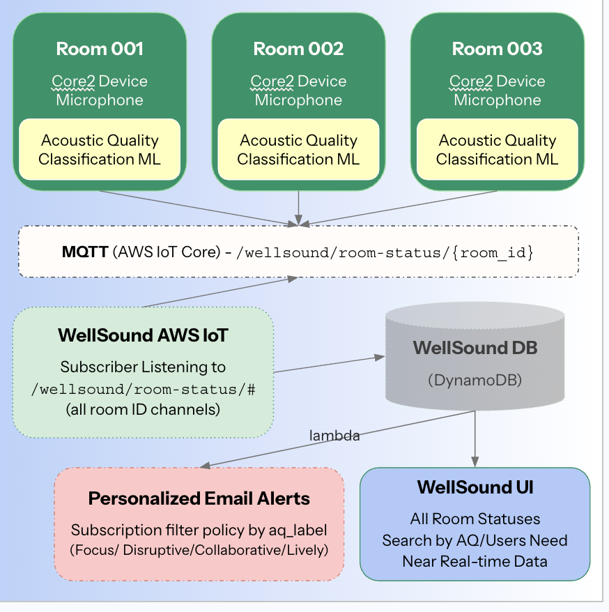

# WellSound — Acoustic Quality Classifier
**End-to-end AIoT System | Columbia University APAN 5570**

Real-time acoustic environment classifier that runs ML inference directly on M5Stack Core2 hardware, streams predictions to AWS IoT Core, and displays room status on a live Streamlit dashboard — helping students find the right space for the right moment.

---

## System Architecture



```
M5Stack Core2 (ESP32)
  │  16kHz microphone → FFT feature extraction → on-device MLP inference
  │  MicroPython — no cloud inference, runs entirely on device
  │
  └──► AWS IoT Core (MQTT over TLS)
         │
         ├──► DynamoDB (room status time-series)
         │
         ├──► Lambda + SNS (email alerts for noise violations)
         │
         └──► Streamlit Dashboard (real-time room finder)
```

---

## Acoustic Quality Labels

| Label | Description | Color |
|---|---|---|
| **Focus** | Quiet & calm — ideal for deep work | 🔵 Blue |
| **Collaborative** | Active voices, moderate level | 🟢 Green |
| **Lively** | High energy, busy | 🟠 Orange |
| **Disruptive** | Harsh noise, very loud | 🔴 Red |

---

## ML Model

**Architecture:** 3-layer MLP — `6 → 16 → 8 → 4`  
**Features (6):** RMS loudness (dB) + 5 spectral band ratios (FFT-derived)  
**Inference:** Runs entirely on-device in MicroPython (no cloud ML)  
**Training:** scikit-learn MLPClassifier → weights exported as `weights_2.json`

### Frequency Bands

| Band | Range | Captures |
|---|---|---|
| Sub-bass | 0–200 Hz | HVAC rumble, deep bass |
| Low | 200–500 Hz | Background presence |
| Mid | 500–2000 Hz | Core voice/speech range |
| High | 2000–5000 Hz | Harshness, speech intelligibility |
| Air | 5000–8000 Hz | High-freq noise (chairs, printers) |

### Two-Speed Temporal Smoothing
- Fast to detect worsening: 3-window majority vote (0.75s)
- Slow to confirm improvement: 10-window majority vote (2.5s)
- Prevents false alarms from transient noise spikes

---

## Repository Structure

```
aiot-wellsound/
├── wellsound_ml_v2.ipynb          # ML training notebook
├── wellsound_odi-stream_v4.py     # On-device inference + MQTT streaming (MicroPython)
├── WellSound_Recorder.py          # Audio recorder for training data collection (MicroPython)
├── wellsound_dashboard_v15_real.py # Real-time Streamlit dashboard
├── Lambda_code.py                 # AWS Lambda for SNS alert routing
├── weights_2.json                 # Trained MLP weights (upload to /flash/ on device)
├── wellsound_system-design.png    # System architecture diagram
└── README.md
```

---

## Setup & Deployment

### 1. Record Training Audio
Use `WellSound_Recorder.py` on the Core2 to record ~5 min per environment:
- `focus.wav` — quiet library / silent study room
- `collab.wav` — group work area / office hours
- `lively.wav` — busy café / active classroom
- `disruptive.wav` — construction noise / subway station

### 2. Train the Model
```bash
# Place all 4 WAV files in the same directory as the notebook
jupyter notebook wellsound_ml_v2.ipynb
# Run all cells → produces weights_2.json
```

### 3. Flash the Device
Upload to Core2 via UIFlow 2.x file manager:
```
/flash/weights_2.json
/flash/certificate/device_cert.crt     ← your own AWS IoT certificate
/flash/certificate/private_key.pem     ← your own AWS IoT private key
/flash/certificate/AmazonRootCA1.pem   ← download from AWS
```
Update `ROOM_ID`, `ROOM_NAME`, and `AWS_ENDPOINT` in `wellsound_odi-stream_v4.py`, then run via UIFlow.

### 4. AWS Setup
- Create AWS IoT Thing with certificate and policy (see policy template in README)
- Create DynamoDB table: `wellsound`
- Create IoT Rule → DynamoDBv2 action on topic `wellsound/room-status/#`
- Deploy `Lambda_code.py` as Lambda function with `SNS_WELLSOUND_ARN` env variable
- Create SNS topic `WellSoundAlert` with email subscriptions + filter policies

### 5. Run Dashboard
```bash
pip install streamlit boto3
# Configure AWS credentials (aws configure or environment variables)
streamlit run wellsound_dashboard_v15_real.py
```

---

## AWS IoT Policy Template

```json
{
  "Version": "2012-10-17",
  "Statement": [
    {
      "Effect": "Allow",
      "Action": "iot:Connect",
      "Resource": "arn:aws:iot:us-east-1:YOUR_ACCOUNT:client/wellsound-*"
    },
    {
      "Effect": "Allow",
      "Action": ["iot:Publish", "iot:Receive"],
      "Resource": "arn:aws:iot:us-east-1:YOUR_ACCOUNT:topic/wellsound/room-status/*"
    },
    {
      "Effect": "Allow",
      "Action": "iot:Subscribe",
      "Resource": "arn:aws:iot:us-east-1:YOUR_ACCOUNT:topicfilter/wellsound/room-status/#"
    }
  ]
}
```

---

## Tech Stack

**Hardware:** M5Stack Core2 (ESP32), built-in microphone  
**On-Device:** MicroPython v1.27.0, UIFlow 2.x, custom MLP inference engine  
**ML Training:** Python, NumPy, SciPy, scikit-learn, matplotlib  
**Cloud:** AWS IoT Core, DynamoDB, Lambda, SNS  
**Dashboard:** Python, Streamlit, boto3  

---

## Security Notes

- **Never commit** device certificates, private keys, or AWS credentials
- Replace `YOUR_AWS_IOT_ENDPOINT` in `wellsound_odi-stream_v4.py` with your own endpoint
- Use AWS IAM roles and environment variables for dashboard credentials
- Add `*.key`, `*.crt`, `*.pem` to `.gitignore`


---

## Disclaimer
Academic project for educational purposes. 
